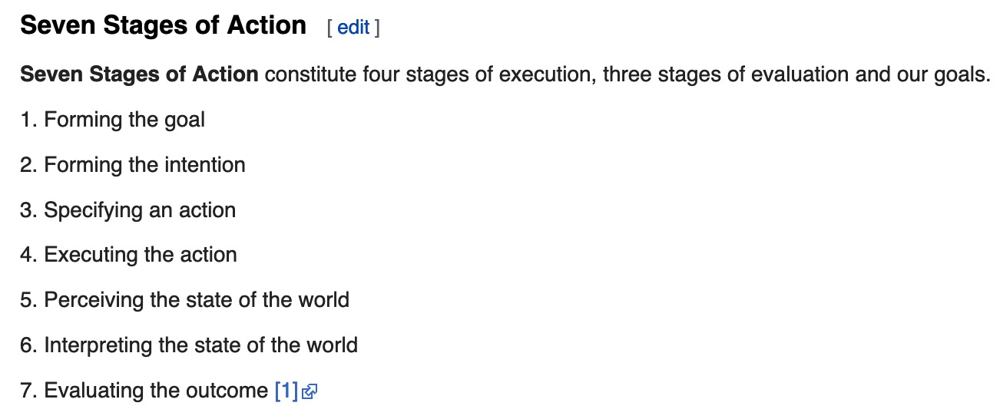

# CPSC 4140

## Don Norman's Theory

*Forming the goal/the goal itself is the baseline starting point, Bart does not consider it one of 6 steps*
- **Plan** to turn my goal into an intention to act
- **Specify** an action sequence
- **Perform** this sequence
- **Perceive** the change
- **Interpret** the change
- **Evaluate** the outcome